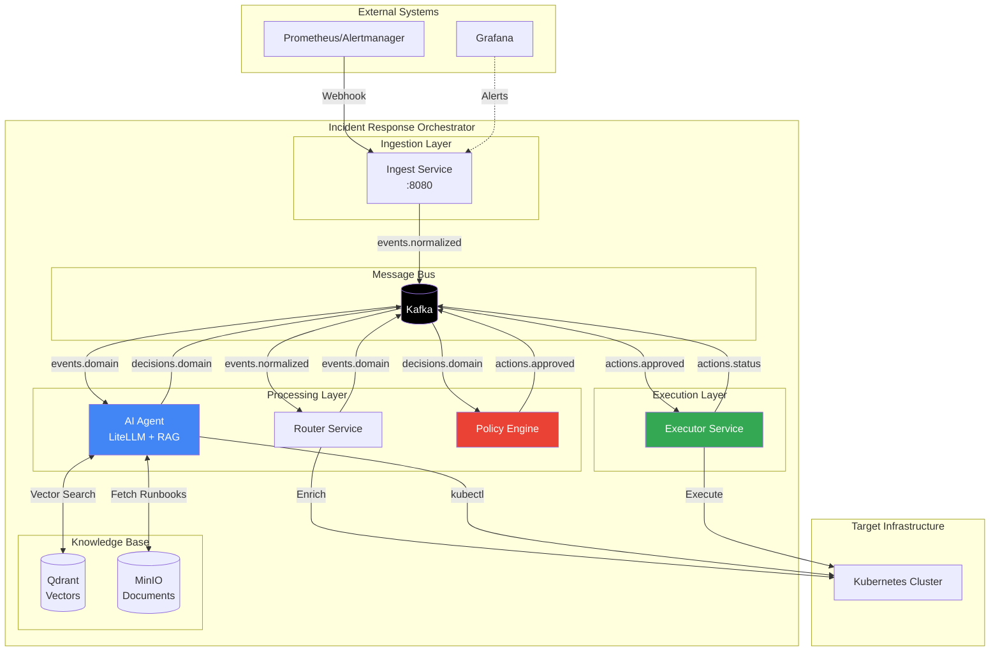
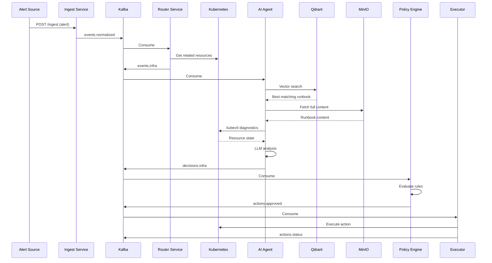

# Incident Response Orchestrator

An event-driven, AI-enhanced incident response platform designed to automate detection, analysis, and remediation of infrastructure incidents.

## Features

- **AI-Powered Analysis**: LLM-driven incident analysis with multi-provider support via LiteLLM
- **Retrieval-Augmented Generation**: Semantic search over runbooks using Qdrant + MinIO
- **Real-Time Diagnostics**: Executes kubectl commands to gather live cluster state
- **Autonomous Remediation**: Executes approved actions against Kubernetes clusters
- **Policy Guardrails**: Rate limiting, namespace restrictions, and action allowlists
- **Event-Driven Architecture**: Loosely coupled services communicating via Kafka
- **Prometheus Metrics**: All services expose `/metrics` endpoints

## Architecture



## Services Overview

| Service | Language | Description |
|---------|----------|-------------|
| [Ingest](services/ingest/README.md) | Go | REST API for alert ingestion with Prometheus metrics |
| [Router](services/router/README.md) | Go | Event enrichment with K8s metadata & routing |
| [AI Agent](services/ai-agent/README.md) | Python | LLM-powered analysis with RAG + real-time diagnostics |
| [Policy Engine](services/policy-engine/README.md) | Go | Action validation with allowlists & rate limiting |
| [Executor](services/executor/README.md) | Go | Kubernetes action execution with rollback support |

## Event Flow



## Quick Start

### Prerequisites

- Docker & Docker Compose
- Go 1.21+
- Python 3.10+
- kubectl
- kind (for local K8s)

### Setup

```bash
# Clone the repository
git clone https://github.com/ChiragJS/IncidentResponseOrchestrator.git
cd IncidentResponseOrchestrator

# Set your API key
export GEMINI_API_KEY=your_google_ai_api_key

# Run automated setup
./scripts/setup.sh
```

For detailed setup instructions, see [SETUP.md](SETUP.md).

### Test the System

```bash
# Trigger an incident
curl -X POST http://localhost:8080/ingest \
  -H "Content-Type: application/json" \
  -d '{
    "source": "prometheus",
    "service_name": "kafka-ingest",
    "alert": "KafkaConsumerLagHigh",
    "description": "Consumer lag is 25000 messages"
  }'

# Watch the deployment scale
kubectl get deployment kafka-ingest -w
```

## Configuration

### Environment Variables

| Variable | Service | Description |
|----------|---------|-------------|
| `GEMINI_API_KEY` | AI Agent | Google AI API key (required for Gemini) |
| `LLM_MODEL` | AI Agent | LiteLLM model string (default: `gemini/gemini-2.5-flash`) |
| `KAFKA_BROKER` | All | Kafka bootstrap servers |
| `MINIO_ENDPOINT` | AI Agent | MinIO server endpoint |
| `QDRANT_HOST` | AI Agent | Qdrant server hostname |
| `CLUSTER_ID` | Router | Kubernetes cluster identifier |

## Policy Engine Rules

The Policy Engine enforces safety guardrails:

| Rule | Description |
|------|-------------|
| **AllowList** | `restart_pod`, `scale_deployment`, `rolling_restart_deployment`, `rollback_deployment`, `gather_logs`, `flush_cache` |
| **Namespace Block** | `kube-system` always blocked |
| **Rate Limit** | Max 3 actions per target per hour |

## Supported Actions

| Action | Description |
|--------|-------------|
| `restart_pod` | Delete a pod to trigger restart (smart fallback to rolling restart) |
| `scale_deployment` | Scale deployment replicas (absolute or relative) |
| `rolling_restart_deployment` | Trigger rolling restart via annotation |
| `rollback_deployment` | Rollback to previous deployment revision |
| `gather_logs` | Collect pod logs for analysis |
| `flush_cache` | Clear application caches |

## Runbook Knowledge Base

10 sample runbooks included:

| Runbook | Use Case |
|---------|----------|
| `kafka_lag.md` | Kafka consumer lag remediation |
| `k8s_crashloop.md` | CrashLoopBackOff troubleshooting |
| `postgres_connection_failure.md` | Database connectivity issues |
| `high_cpu_usage.md` | CPU throttling remediation |
| `disk_space_low.md` | Storage management |
| `api_5xx_errors.md` | API error handling |
| `k8s_dns_failure.md` | DNS resolution issues |
| `k8s_node_not_ready.md` | Node health issues |
| `redis_latency.md` | Redis performance tuning |
| `ssl_certificate_expiry.md` | Certificate management |

### Adding Custom Runbooks

1. Add markdown files to `runbooks/` directory
2. Run ingestion:
   ```bash
   docker exec deploy-ai-agent-1 python3 src/scripts/ingest_runbooks.py /app/runbooks
   ```

## Directory Structure

```
IncidentResponseOrchestrator/
├── services/
│   ├── ingest/          # Alert ingestion API
│   ├── router/          # Event enrichment & routing
│   ├── ai-agent/        # LLM-powered analysis (LiteLLM + RAG)
│   ├── policy-engine/   # Action validation
│   └── executor/        # K8s action execution
├── pkg/                 # Shared Go libraries
├── contracts/           # Protobuf definitions
├── runbooks/            # SRE runbook knowledge base (10 runbooks)
├── deploy/              # Docker Compose & Helm
├── scripts/             # Automation scripts
└── tests/               # Integration tests
```

## Observability

| Tool | Port | Credentials |
|------|------|-------------|
| Grafana | 3000 | admin/admin |
| Prometheus | 9091 | - |
| Loki | 3100 | - |
| MinIO Console | 9001 | minioadmin/minioadmin |

### Service Metrics

All services expose Prometheus metrics:

| Service | Metrics Port |
|---------|-------------|
| Ingest | :8080/metrics |
| Router | :9090/metrics |
| Policy Engine | :9090/metrics |
| Executor | :9090/metrics |

## Tech Stack

| Component | Technology |
|-----------|------------|
| **Backend Services** | Go 1.21+, Python 3.10+ |
| **Message Bus** | Apache Kafka (KRaft mode) |
| **LLM Provider** | LiteLLM (Gemini, OpenAI, Anthropic, etc.) |
| **Vector Database** | Qdrant |
| **Object Storage** | MinIO |
| **Container Orchestration** | Kubernetes |
| **Observability** | Prometheus, Grafana, Loki |
| **Serialization** | Protocol Buffers |

## Future Enhancements

- [ ] Human-in-the-loop approval workflow
- [ ] Multi-cluster support
- [ ] OPA policy integration
- [ ] Cost tracking for LLM usage
- [ ] Feedback loop for action outcomes
- [ ] Webhook authentication
- [ ] Persistent rate limiting (Redis)
- [ ] Context window management for LLM

## License

MIT License
