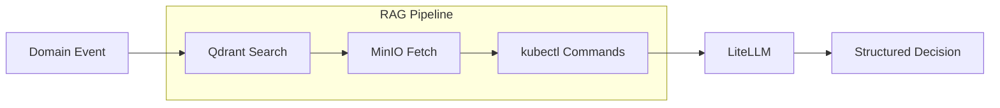

# AI Agent Service

The AI Agent is the intelligent core of the Incident Response Orchestrator. It uses Retrieval-Augmented Generation (RAG) with LLM abstraction via LiteLLM to analyze incidents and propose remediation actions.

## Responsibility

- Consume domain events from `events.{domain}` topics
- Retrieve relevant runbooks using vector search (Qdrant)
- Fetch full runbook content from MinIO
- **Execute diagnostic kubectl commands** to gather real-time cluster state
- Analyze incidents using LLM (Gemini by default, with multi-provider support)
- Propose structured remediation actions
- Publish decisions to `decisions.{domain}` topics

## RAG Pipeline

```
Event → Qdrant (Vector Search) → MinIO (Full Content) → Diagnostics → LLM → Decision
```

## Architecture



## Supported Features

### Core Analysis
- [x] Kafka consumer/producer integration
- [x] Qdrant vector database for semantic search
- [x] MinIO document store for runbook content
- [x] Structured JSON output parsing
- [x] Confidence scoring (0.0 - 1.0)
- [x] Strict action schema enforcement

### LLM Provider (LiteLLM Abstraction)
- [x] **Multi-provider support** via LiteLLM (Gemini, OpenAI, Anthropic, etc.)
- [x] **Smart rate limiting** with Retry-After header support
- [x] **Automatic retries** with exponential backoff
- [x] **Configurable timeouts** (default 120s)
- [x] **Embedding support** for multiple providers

### Diagnostic Capabilities
- [x] **Resource discovery** - Finds actual pods/deployments in cluster
- [x] **Kubectl command execution** for real-time diagnostics
- [x] **Command output parsing** and integration into LLM context
- [x] **Fallback diagnostics** when LLM command generation fails
- [x] **Alert deduplication** to prevent redundant analysis

### Safety Features
- [x] **Input sanitization** to prevent prompt injection
- [x] **System component filtering** (ignores kube-system, minio, qdrant, kafka alerts)
- [x] **Command timeout handling** (30s default)

### Supported Action Types

| Action Type                 | Description                              |
|-----------------------------|------------------------------------------|
| `restart_pod`               | Delete a pod to trigger restart          |
| `scale_deployment`          | Scale deployment replicas up/down        |
| `rolling_restart_deployment`| Trigger rolling restart via annotation   |
| `rollback_deployment`       | Rollback to previous deployment revision |
| `gather_logs`               | Collect pod logs for analysis            |
| `flush_cache`               | Clear application caches                 |

## Not Yet Implemented

- [ ] **Streaming Responses**: Full response buffering
- [ ] **Context Window Management**: No token limit handling
- [ ] **Human-in-the-Loop**: No approval workflow for high-risk actions
- [ ] **Feedback Loop**: No learning from action outcomes
- [ ] **Cost Tracking**: No LLM API cost monitoring

## Runbook Ingestion

Use the ingestion script to populate the knowledge base:

```bash
docker exec deploy-ai-agent-1 python3 src/scripts/ingest_runbooks.py /app/runbooks
```

### Supported Runbook Formats

- Markdown (`.md`)
- Plain Text (`.txt`)
- PDF (`.pdf`)
- JSON (`.json`)
- YAML (`.yaml`)

## Configuration

| Environment Variable   | Default              | Description                             |
|-----------------------|----------------------|-----------------------------------------|
| `KAFKA_BROKER`        | `localhost:9092`     | Kafka bootstrap servers                 |
| `LLM_MODEL`           | `gemini/gemini-2.5-flash` | LiteLLM model string              |
| `GEMINI_API_KEY`      | *required*           | Google AI API key (for Gemini)          |
| `OPENAI_API_KEY`      | -                    | OpenAI API key (optional)               |
| `ANTHROPIC_API_KEY`   | -                    | Anthropic API key (optional)            |
| `QDRANT_HOST`         | `qdrant`             | Qdrant server hostname                  |
| `MINIO_ENDPOINT`      | `minio:9000`         | MinIO server endpoint                   |
| `MINIO_ROOT_USER`     | `minioadmin`         | MinIO access key                        |
| `MINIO_ROOT_PASSWORD` | `minioadmin`         | MinIO secret key                        |
| `LLM_RATE_LIMIT_RPM`  | `5.0`                | Rate limit: requests per minute         |
| `LLM_TIMEOUT`         | `120.0`              | LLM request timeout in seconds          |

## Tech Stack

- **Language**: Python 3.10+
- **LLM**: LiteLLM (supports Gemini, OpenAI, Anthropic, and 100+ providers)
- **Vector DB**: Qdrant
- **Object Store**: MinIO
- **Messaging**: Kafka (confluent-kafka-python)
