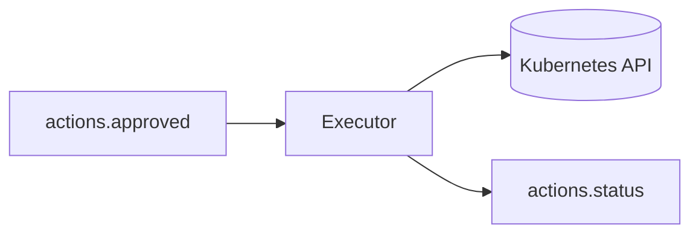

# Executor Service

The Executor Service is the actuator of the Incident Response Orchestrator. It executes approved remediation actions against the target Kubernetes cluster.

## Responsibility

- Consume approved actions from `actions.approved` topic
- Execute actions against Kubernetes cluster
- Report execution status to `actions.status` topic

## Supported Actions

| Action Type                   | K8s Operation                               |
|------------------------------|---------------------------------------------|
| `restart_pod`                | Delete pod (triggers replacement)           |
| `scale_deployment`           | Update deployment replica count             |
| `rolling_restart_deployment` | Add restart annotation to trigger rollout   |
| `rollback_deployment`        | Rollback to previous revision via kubectl   |

### `restart_pod` Smart Handling

The executor intelligently handles `restart_pod`:
- If target has `deployment/` prefix → triggers `rolling_restart_deployment`
- If pod not found → falls back to `rolling_restart_deployment`
- Otherwise deletes the specific pod

### `scale_deployment` Parameters

| Parameter            | Description                         |
|---------------------|-------------------------------------|
| `replicas`          | Absolute replica count              |
| `replicas_increment`| Relative change (+1, -1, etc.)      |
| `replicas_increase` | Alternative name for increment      |
| `namespace`         | Target namespace (default: `default`)|

### `rolling_restart_deployment` Parameters

The executor adds `kubectl.kubernetes.io/restartedAt` annotation to trigger a rolling restart.

### `rollback_deployment` Parameters

Executes `kubectl rollout undo deployment/<name> -n <namespace>` to rollback to the previous revision.

## Architecture



## Supported Features

- [x] Kubernetes client integration (client-go)
- [x] Pod deletion for restart
- [x] Deployment scaling (absolute and relative)
- [x] Rolling restart via annotation
- [x] **Rollback to previous revision**
- [x] **Smart action fallback** (pod → deployment)
- [x] **Simulation mode** (when K8s client unavailable)
- [x] Status reporting to Kafka
- [x] **Prometheus metrics** (`/metrics` on port 9090)
- [x] **In-cluster config support** (for pod deployment)
- [x] **Local kubeconfig support** (for development)
- [x] **Graceful shutdown** on SIGINT/SIGTERM

## Not Yet Implemented

- [ ] **Dry-Run Mode**: No preview before execution
- [ ] **Automatic Rollback**: No undo on action failure
- [ ] **Timeout Handling**: No execution timeouts
- [ ] **Multi-Cluster**: Single cluster support only
- [ ] **Custom Resources**: Only core K8s resources (no CRDs)
- [ ] **Helm/Kustomize**: No chart-based operations

## Configuration

| Environment Variable | Default          | Description               |
|---------------------|------------------|---------------------------|
| `KAFKA_BROKER`      | `localhost:9092` | Kafka bootstrap servers   |
| `KUBECONFIG`        | `~/.kube/config` | Path to kubeconfig file   |

## Execution Flow

```
actions.approved → Executor → K8s API
                          ↓
              actions.status (success/failed)
```

## Simulation Mode

When no kubeconfig is available, the Executor runs in simulation mode:
- Logs the action that *would* be taken
- Waits 2 seconds (simulated work)
- Reports success

This enables testing the full pipeline without a real Kubernetes cluster.

## Tech Stack

- **Language**: Go 1.21+
- **K8s Client**: client-go
- **Messaging**: Kafka (confluent-kafka-go)
- **Logging**: Zap (structured logging)
- **Metrics**: Prometheus client
