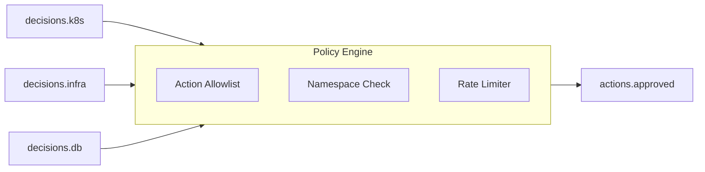

# Policy Engine Service

The Policy Engine is the safety layer of the Incident Response Orchestrator. It evaluates proposed actions against predefined rules before they can be executed.

## Responsibility

- Consume decisions from `decisions.{domain}` topics (k8s, infra, db)
- Evaluate each proposed action against policy rules
- Approve or reject actions based on:
  - Action type allowlist
  - Namespace restrictions
  - Rate limiting
- Publish approved actions to `actions.approved` topic

## Policy Rules

### 1. AllowList (Action Types)

Only these action types are permitted:

| Allowed Actions               |
|-------------------------------|
| `restart_pod`                 |
| `scale_deployment`            |
| `rolling_restart_deployment`  |
| `rollback_deployment`         |
| `gather_logs`                 |
| `flush_cache`                 |

Any other action type is **automatically rejected**.

### 2. Namespace Restrictions

| Namespace     | Status                      |
|---------------|-----------------------------|
| `default`     | ✅ Allowed                   |
| `apps`        | ✅ Allowed                   |
| `staging`     | ✅ Allowed                   |
| `kube-system` | ❌ Blocked                   |
| `production`  | ❌ Requires human approval   |

### 3. Rate Limiting

- **Max 3 actions** per target per hour
- Prevents runaway automation loops
- In-memory tracking (resets on restart)

## Architecture

## Supported Features

- [x] Kafka consumer/producer integration
- [x] **Multi-domain support** (k8s, infra, db topics)
- [x] Action type allowlist validation
- [x] Namespace-based access control
- [x] In-memory rate limiting
- [x] Detailed rejection reasons in logs
- [x] **Auto-approver tagging** (`policy_engine_auto`)
- [x] **Prometheus metrics** (`/metrics` on port 9090)
- [x] **Graceful shutdown** on SIGINT/SIGTERM

## Not Yet Implemented

- [ ] **Persistent Rate Limits**: In-memory only (resets on restart)
- [ ] **External Policy Store**: Hardcoded rules (no OPA integration)
- [ ] **Human Approval Workflow**: No pending queue for manual review
- [ ] **Audit Logging**: No persistent audit trail
- [ ] **Policy Versioning**: No rollback capability
- [ ] **Dynamic Reload**: Requires restart to update rules

## Configuration

| Environment Variable | Default          | Description              |
|---------------------|------------------|--------------------------|
| `KAFKA_BROKER`      | `localhost:9092` | Kafka bootstrap servers  |

## Tech Stack

- **Language**: Go 1.21+
- **Messaging**: Kafka (confluent-kafka-go)
- **Logging**: Zap (structured logging)
- **Metrics**: Prometheus client
