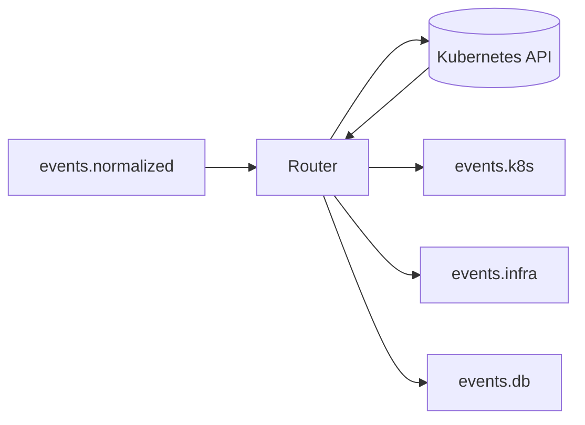

# Router Service

The Router Service is responsible for enriching incoming events with Kubernetes context and routing them to domain-specific Kafka topics.

## Responsibility

- Consume events from `events.normalized` topic
- Enrich events with Kubernetes metadata (cluster ID, related resources)
- Determine the event domain (k8s, infra, db)
- Route enriched events to domain-specific topics (e.g., `events.k8s`, `events.infra`)

## Event Flow

```
events.normalized → Router → events.{domain}
```

## Architecture



## Supported Features

- [x] Kafka consumer/producer integration
- [x] Service name extraction from alert payload
- [x] **Kubernetes client integration** for real enrichment
- [x] Dynamic domain detection (k8s, infra, db)
- [x] Related resource discovery (deployments, pods)
- [x] Configurable cluster ID via environment variable
- [x] **Prometheus metrics** (`/metrics` on port 9090)
- [x] **Graceful shutdown** on SIGINT/SIGTERM
- [x] **In-cluster config support** (for pod deployment)
- [x] **Local kubeconfig support** (for development)

## Not Yet Implemented

- [ ] **Multi-cluster Support**: Single cluster only
- [ ] **Node/Service Affinity**: No topology-aware enrichment
- [ ] **Caching**: K8s queries on every event (no cache)
- [ ] **Custom Domain Rules**: Hardcoded domain logic
- [ ] **Dead Letter Queue**: Failed events are dropped

## Enrichment Logic

The Router extracts and adds:

| Field               | Source                                    |
|---------------------|-------------------------------------------|
| `service_name`      | Alert payload (`service_name`)            |
| `cluster_id`        | Environment variable `CLUSTER_ID`         |
| `related_resources` | K8s API query for matching deployments/pods |
| `domain`            | Inferred from source/alert keywords       |

## Configuration

| Environment Variable | Default              | Description              |
|---------------------|----------------------|--------------------------|
| `KAFKA_BROKER`      | `localhost:9092`     | Kafka bootstrap servers  |
| `CLUSTER_ID`        | `default-cluster`    | Kubernetes cluster name  |

## Tech Stack

- **Language**: Go 1.21+
- **K8s Client**: client-go
- **Messaging**: Kafka (confluent-kafka-go)
- **Logging**: Zap (structured logging)
- **Metrics**: Prometheus client
